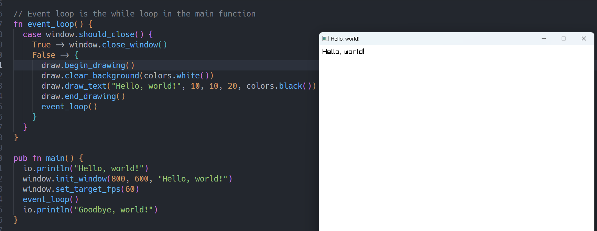
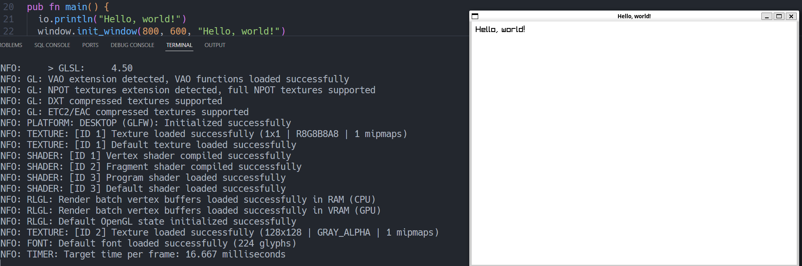

# Attempt 2 at getting Raylib on Gleam to work

This time I'm using the Rust FFI to see if an unsafe Rust approach will work.

Dealing with complex objects in Rust would be hard to translate to Gleam, so I'm using the Rust FFI which while unsafe, should reduce the complexity of the code.

Basic test uses:

```sh
erl
```

```erlang
c(raylib).
raylib:init_window(800, 600, <<"Hello, world">>).
```

| OS      | Status | Notes                                   |
| ------- | ------ | --------------------------------------- |
| macOS   | ❌     | Compiles and runs but no window appears |
| Linux   | ✔️     | Tested on WSL                           |
| Windows | ✔️     | This was tested and works               |



